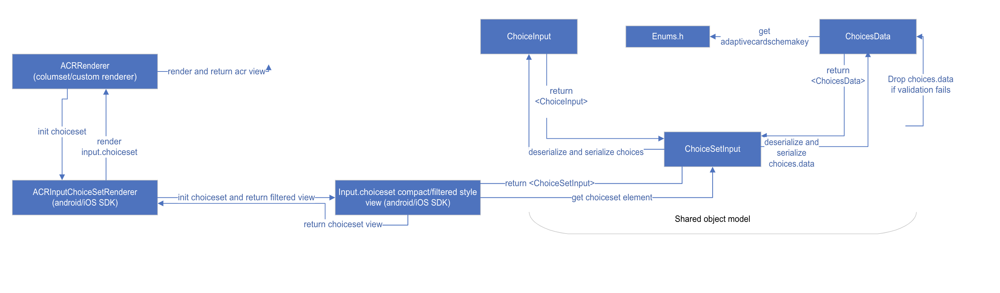

<!-- AUTO-GENERATED: This section is auto-generated from schemas/adaptive-card.json. Do NOT add anything above this or edit anything inside, it MUST be the first thing in the document and will be overwritten. -->

# Dynamic Typeahead search
##Shared Object Model 

ChoiceSet will now have "choices.data property added to them. This property allow a card author to specify whether or not an input can dynamically fetch the list of choices from a remote backend/bot as the user types.
Additionally, a isMultiSelect:true will also be added to Input.ChoiceSet to allow users to select multiple choices from the list of choices, if set to true.

Choices.data property
| Property | Type | Required | Description | Version | Behaviour |
| -------- | ---- | -------- | ----------- | ------- | ------- |
| **type** | `Data.Query` | Yes | Specifies that this is a Data.Query object.  | 1.5 | If not specified or not set to Data.Query we will drop choices.data and the behaviour of Input.choiceset remains the same.
| **dataset** | `string` | Yes | The type of data that should be fetched dynamically | 1.5 | If not specified or invalid, we will drop choices.data and the behaviour of Input.choiceset remains the same.
| **value** | `string` | No | Populated for the invoke request to the bot with the input the user provided to the ChoiceSet  | 1.5 | optional
**skip** | `int` | No | Populated for the invoke request to the bot to specify how many elements should be returned (can be ignored by the bot, if they want to send a diff amount)  | 1.5 | optional
**count** | `int` | No | Populated for the invoke request to the bot to indicate that we want to paginate and skip ahead in the list  | 1.5 | optional

The below changes will define that a ChoiceSet needs to dynamically fetch data from the bot or from the client(in case of people picker).

## choices.data

`Choice.data` options.

### type
* **Type**: `type`
* **Required**: Yes
* **Allowed values**:
  * `Data.Query`


### dataset

* **Type**: `dataset`
* **Required**: Yes
* **Allowed values**:
  * only string is allowed

**Example card:**
Input.ChoiceSet
```json
{
    "type": "Input.ChoiceSet",
    "id": "selectedUser",
    "choices": [
        { "title": "Static 1", "value": "Static 1" }
    ],
    "choices.data": {
        "type": "Data.Query",
        "dataset": "graph.microsoft.com/users"
    },
     “isMultiSelect”: true
}
```



Choices.data class in shared object model parses and serializes the choices.data property. Also, we will validate type as data.query which is defined in choices.data. We will have to identify what to do when there is an error in parsing. for eg: if any of the required properties are missing, we can either skip the deserialization/serialization for choices.data or return json parsing error to the host and host can show error view to the user. (This is the case where adaptive card rendering failed).

1. We can simply drop choices.data and will fallback to the existing experience of input.choiceset. We will make changes to the parsing logic for choices.data and the changes will allow cards to render even if the required properties are missed.
   Pros: This will not break rendering experience for the user.
2. Adaptive card rendering fails if required properties are not defined correctly. This behavior is due to the fact that the card has required properties are missing.
	Pros: Invalid json error returned to the host so developers can identify that there is some parsing related issue with the json.

Existing experience - If we fail to specify correct title and value props with choices prop then, adaptive card rendering fails.

OPEN QUESTIONS:
1. What should be the desired behaviour if required properties are missing? 

2. What should be the desired behaviour if there is an error in parsing choices.data. Scenario - If type is not defined as data.query or dataset is not string.

<!-- END AUTO-GENERATED -->
 