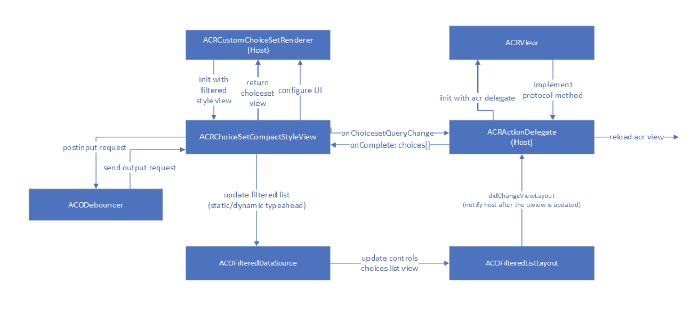

<!-- AUTO-GENERATED: This section is auto-generated from schemas/adaptive-card.json. Do NOT add anything above this or edit anything inside, it MUST be the first thing in the document and will be overwritten. -->

# Dynamic Typeahead search

###Communication from host to sdk and sdk to host
Option 1:
we can make use of notifications for async communication in iOS.
Option 2:
We will do communication asynchronously using gcd and compleion block.

### Communication with Host to fetch Dynamic choices

For this feature, we need two way communication with the host (host to sdk and sdk to host).
Why do we need this?
 We will have to send the query to the host whenever query is changing in the input control so that host can make an invoke to the bot and once the choices is returned by the host we will update the choices in the UI.
 1. SDK to host: Sdk will notify the host about the query change in choiceset input control and then host can do the network/service call and return response to the sdk.
 2. Async Host to SDK : Now once host receives the choices from the bot and then will need to update the UX based on the dynamic choices received from the host. We will have completion block on the SDK side to handle this scenario.

### Recommended Approach

1. SDK will define the protocol **ACRInputDelegate** to communicate with the host. Host will need to implement the same protocol ACRInputDelegate as provided by the SDK. ACRMediaDelegate and ACRActionDelegate also uses the protocol method for one way communication.
2. Host will call the method into the render method of the AdaptiveCardRenderer and pass the cardActionHandler instance.
3. AdaptiveCardRenderer creates an instance of cardActionHandler and input handler. Also, views of all the components are added to this instance.
4. Now to render choicesetinput control, adaptiveCardRenderer will call ACRInputChoiceSetRenderer and pass the input choiceset delegate also. This will then call ACRChoiceSetCompactStyleView for compact,filtered and dynamic typeahead control rendering.
5. On any input change in choiceset control, SDK will notify the host with the help of delegate method asynchronously and will also paas the  query string and base action element that has choiceset properties.
6. Now host will make invoke call to the bot/service to fetch response for the sent query. Once host received a response with dynamic choices then host will simply return those choices to the SDK.
7. SDK will update the UI controls once response is received and will also update host to change any layout related constraint.
Also, this sequence diagram shows the flow for inline choiceset experience.

Sequence Diagram : Async communication 

onChoiceSetQueryChange method paramters in ACRInputDelegate protocol
| Parameter | Type | Description |
| :------- | :----- | :------------------------------------------------------------------------------------------
| baseCardElement | BaseCardElement | ChoiceSetInput element on which text change was observed |
| queryText | String | Text in the Input.ChoiceSet entered by the user |
| completion |  | Completion block with choices[] as response or NSError in case of any failure

updateChoices method parameters in
| Parameter | Type | Description |
| :------- | :----- | :------------------------------------------------------------------------------------------
| choices[] | Choices [] | Dynamic choices for the query text from the service |

#### Debounce Logic

Debouncer is a helper which implements the debounce operation on a stream of data. e.g. When user is typing in a UITextField, each edit operation is pushed into the debouncer, and the debouncer will
only perform the callback when a certain minimum time say 3ms has been elapsed since last keystroke by the user.

- First we need to initialize the input view with debouncer object
- (void)postInput:(id)input - post input method will put the request in queue till the delay has been elapsed. 
- (void)sendOutput:(id)output - once the minimum time is elapsed debouncer will send the request to UITextField and hence sdk will make a call to the host with query text.

#### Loading experience

While the host resolves the request for dynamic choices requested by the sdk, we continue to show the static choices.

1. We can add a loader to indicate that dynamic choices are being fetched.
2. We fetch the dynamic choices silently and append the result once its available.

#### Failure scenarios 

1. We have to show error message to the user when bot return with the error
2. We will use a maximum time limit to fetch dynamic choices in the host config. We show an error message if the choices are not fetched in this time limit.
3. We will have a way to customize error message based on the host's response. Host can return localized error message to the SDK when invoke call completes. SDK will show error message on the UX.

#### How host can configure the styles of UI
#####Inline experience:
We can expose few properties in the compact style view and that can be easily accessed in choiceset custom renderer. 

@interface ACRChoiceSetCompactStyleView
@property NSString *id;
@property NSMutableDictionary *results;
@property (weak) UIView *filteredListView;
@property (weak) UIView *showFilteredListControl;
/// top margin of filtered list view
@property CGFloat spacingTop;
/// bottom margin of filtered list view
@property CGFloat spacingBottom;

///dynamic typeahead interface
void showLoadingIndicator()
void hideLoadingIndicator()
void configureDynamicTypeaheadUI()
void updatePrimaryContentView(choices[])

init method of compact style view is called from choiceset custom renderer and we can always send config ui request back to the host so that host has the flexibility to update the style and layout constraint.

We will give host the ability to configure the UX based on their requirements. Host can achieve the styles of UI with the above configure method. Here are few examples of what can be achieved:
- set the chevron icon for expanding and collapsing the filtered list manually.
- update the layout of the list view (eg. if host may want to add separator in the choices list and for that we are using UITableView)
- can update the layout of the choicesetview (eg. border/spacingtop/spacing down)
- can register class for list layout cell
- can configure loading indicator to the table view and sdk will send request to show/hide the view (TODO: needs more investigation)

#### Full screen view for static and dynamic typeahead control
TODO

<!-- END AUTO-GENERATED -->