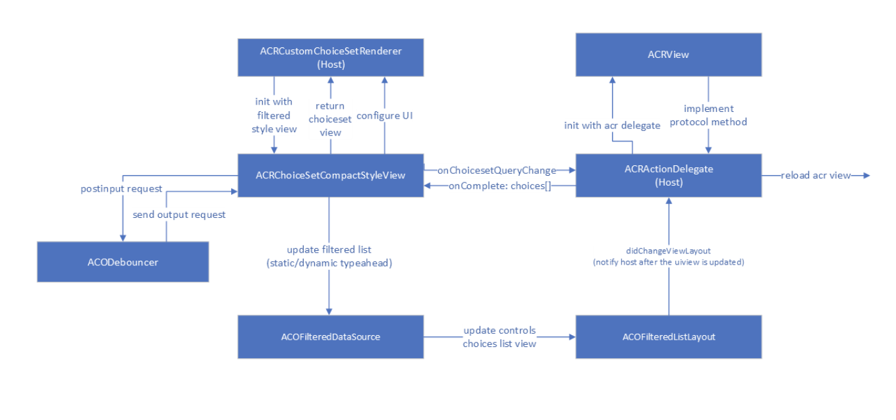

<!-- AUTO-GENERATED: This section is auto-generated from schemas/adaptive-card.json. Do NOT add anything above this or edit anything inside, it MUST be the first thing in the document and will be overwritten. -->

# Dynamic Typeahead search in adaptive cards in iOS client

This document will cover overall implementation of dynamic typeahead feature in iOS client. Also, we will cover all the changes needed to support Dynamic Type Ahead search to Input.ChoiceSet in adaptive cards with respect to iOS client.

[DynamicTypeaheadDetailedSpec](https://github.com/karthikbaskar/AdaptiveCards/blob/dipja/dynamic-type-ahead-doc/specs/DesignDiscussions/DynamicTypeAhead.md)

### Communication with the host to fetch dynamic choices
We will have to send the query to the host whenever search text is changing in the choiceset input control so that host can fetch dynamic choices and once the choices is returned by the host, we will update the choices in the UI.
1. SDK to host: Sdk will notify the host about the query change in choiceset input control and then host can do the network/service call and return response to the sdk.
 2. Async Host to SDK : Now once host receives the choices from the bot and will need to update the UX based on the dynamic choices received from the host. We will have completion block on the SDK side to handle this scenario.

**Inline Choiceset input control**
This sequence diagram shows the flow for inline choiceset experience in case of dynamic typeahed search.

1. SDK will define the protocol **ACRInputDelegate** to communicate with the host. Host will need to implement the same protocol ACRInputDelegate as provided by the SDK. ACRMediaDelegate and ACRActionDelegate also uses the protocol method for one way communication.
2. Host will call the method into the render method of the AdaptiveCardRenderer and pass the cardActionHandler instance.
3. AdaptiveCardRenderer creates an instance of cardActionHandler and input handler. Also, views of all the components are added to this instance.
4. Now to render choicesetinput control, adaptiveCardRenderer will call ACRInputChoiceSetRenderer and pass the input choiceset delegate also. This will then call ACRChoiceSetCompactStyleView for compact,filtered and dynamic typeahead control rendering.
5. On any input change in choiceset control, SDK will notify the host with the help of delegate method asynchronously and will also paas the  query string and base action element that has choiceset properties.
6. Now host will make invoke call to the bot/service to fetch response for the sent query. Once host received a response with dynamic choices then host will simply return those choices to the SDK.
7. SDK will update the UI controls once response is received and will also update host to change any layout related constraint.

onChoiceSetQueryChange method paramters in ACRInputDelegate protocol
| Parameter | Type | Description |
| :------- | :----- | :------------------------------------------------------------------------------------------
| baseCardElement | BaseCardElement | ChoiceSetInput element on which text change was observed |
| queryText | string | Text in the Input.ChoiceSet entered by the user |
| completion |  | Completion block with choices[] as response or NSError in case of any failure

updateChoices method parameters in
| Parameter | Type | Description |
| :------- | :----- | :------------------------------------------------------------------------------------------
| choices[] | Choices [] | Dynamic choices for the query text from the service |

### Debounce Logic

Debouncer is a helper which implements the debounce operation on a stream of data. e.g. When user is typing in a UITextField, each edit operation is pushed into the debouncer, and the debouncer will only perform the callback when a certain minimum time xms (say 250ms) has been elapsed since last keystroke by the user.

- First we need to initialize the input view with debouncer object
- postInput:(id)input - post input method will put the request in queue till the delay has been elapsed. 
- sendOutput:(id)output - once the minimum time is elapsed debouncer will send the request back to the caller.

### Loading experience

While the host resolves the request for dynamic choices requested by the sdk, we continue to show the static choices.
We can add an activity indicator to indicate that dynamic choices are being fetched from the host. We can expose showLoader and hideLoader in the SDK so that host can be notified when to show/hide loading indicator.

### Handling errors 

1. We have to show error message to the user when bot return with the error
2. We will use a maximum time limit to fetch dynamic choices in the host config. We show an error message if the choices are not fetched in this time limit.
3. We will have a way to customize error message based on the host's response. Host can return localized error message to the SDK when invoke call completes.

### User Experience

**Inline choiceset input control for dynamic typeahead:**
We can extend the functionality of existing static typeahead experience for supporting dynamic typeahead search in input.choiceset. We will refactor the ACRChoicesetCompactstyleView class to support dynamic typeahead search.

Also, We will give host the ability to configure the UX based on their requirements. We will expose few methods in the filtered style view to configure the styles of UI and that can be easily accessed in choiceset custom renderer.
Here are few examples of what UI styles can be updated by host:
- add the chevron icon for expanding and collapsing the filtered list manually.
- update the layout of the list view (eg. if host may want to add separator in the choices list and for that we are using UITableView)
- update the layout of the choicesetview (eg. border/spacingtop/spacing down)
- register class for list layout cell
- configure loading indicator to the table view and sdk will send request to host show/hide the view.

How host can configure the styles of UI?
- init method of filtered style view is called from custom choiceset renderer 
- send request for configuring UI back to the host so that host has the flexibility to update the style and layout constraint.

**Full screen view for static and dynamic typeahead control**

 

<!-- END AUTO-GENERATED -->
