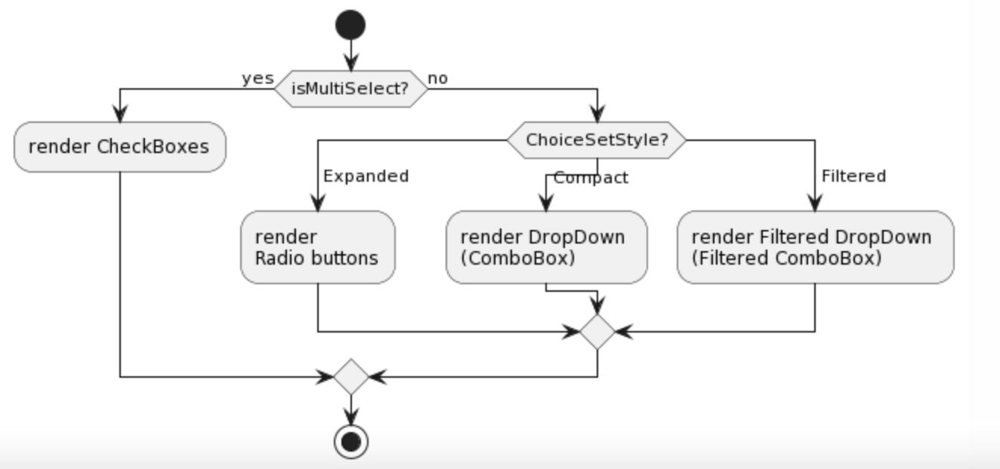
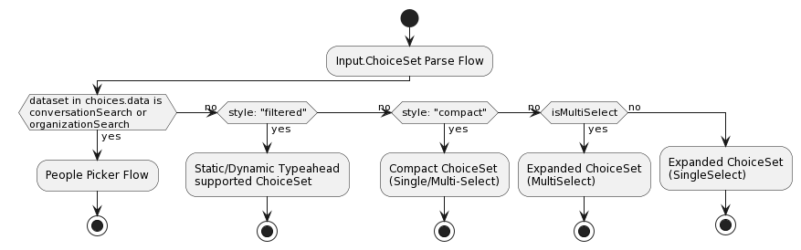
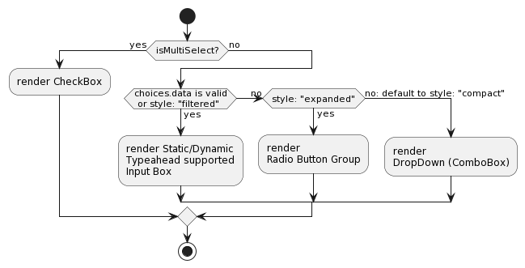
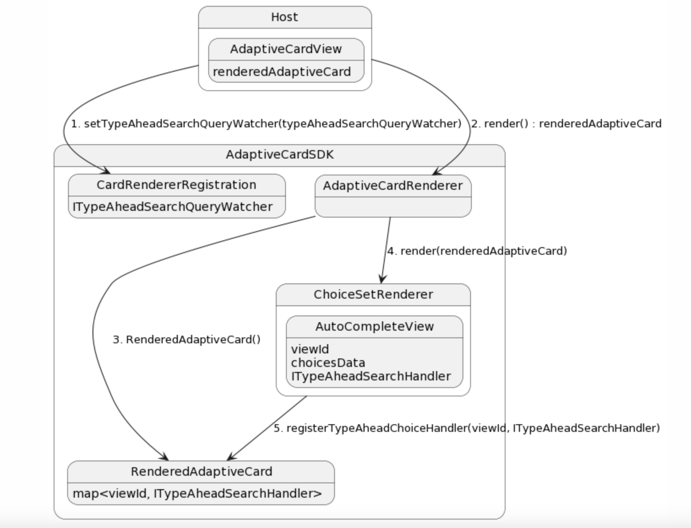
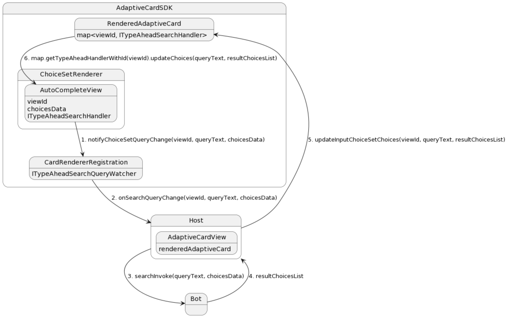
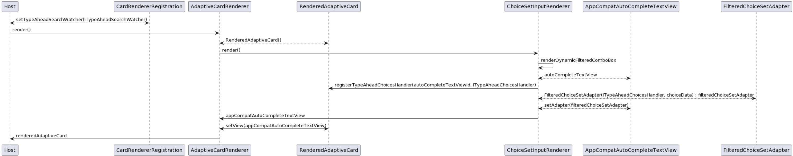
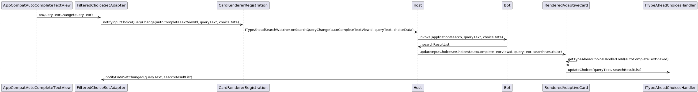

# Type Ahead Seach in Input.ChoiceSet

## Summary

When there are thousands of choices in a menu (like assigning a task to someone, when there's thousands of people in your org), you need to have a searchable select menu that dynamically loads data as the user searches (since including 1,000 or more choices statically in the card/data isn't a good option).

This document covers feature changes to add Type ahead search support to Input.ChoiceSet in adaptive cards. Discussions and considerations that lead to this spec.

## Requirements

P0: The input can dynamically fetch the list of choices from a remote backend as the user types

P0: Hosts can specify 1 or more pre-determined datasets that get the first-chance to fulfill the request. (E.g., Microsoft Teams could query the Active Directory list of users by hooking into the graph.microsoft.com/users dataset). If the host hasn't registered a matching dataset, the request will be sent to the backend.

P0: A static list of choices can be provided, and any dynamic ones will get appended to the end

P1: The input will support "isMultiSelect": true and "style": "filtered"

P1: Search dynamically renders a list (which has custom UI for each element) with the search result

## Schema Changes

Input.ChoiceSet
| Property | Type | Required | Description
| :---------- | :------- | :---------- | :------- |
| choices.data | Data.Query | No | Enables dynamic typeahead as the user types, by fetching a remote set of choices from a backend.

Data.Query Definition
| Property | Type | Required | Description
| :---------- | :------- | :---------- | :------- |
| type | Data.Query | Yes | Specifies that this is a Data.Query object.
| dataset| String | Yes | The type of data that should be fetched dynamically
| value | String | No | Populated for the invoke request to the bot with the input the user provided to the ChoiceSet
| count | number | No | Populated for the invoke request to the bot to specify how many elements should be returned (can be ignored by the bot, if they want to send a diff amount)  
| skip | number | No | Populated for the invoke request to the bot to indicate that we want to paginate and skip ahead in the list

## Type Ahead Rendering and Changes

1. Add choice.data schema to Input.ChoiceSet
2. ChoiceSetInputRenderer - Support type ahead search control rendering. Support multi select mode as well.
3. Communicate change in SearchText in TypeAheadSearch control to host and get updated choices for the same.
   a. Register TypeAheadSearchWatcher on CardRendererRegistration on the lines of InputWatcher.
   b. ChoiceSetInputRenderer uses ITypeAheadSearchHandler which can be defined by the host and can be set on the ChoiceSetInputRender.
   c. ICardActionHandler is used for processing onActionClicks, similary SDK can expose another interface for communication between SDK and host for TypeAheadControl which the host to implement.
4. Loading experience while the dynamic choices are being fetched from the host through a bot/backend.
5. Debouncing logic - Implement a default debouncing logic in the SDK. Allowing host to override this debouncing logic.

### Current Input.ChoiceSet rendering

Diagram - https://www.plantuml.com/plantuml/uml/POynRiCm34LtdeAZV8LcI52dtRhKQnT5Pc2YicY859BSldG3D4cZwOEVxqdQgSLgRSxm6m3uY87resNZWJ8bstPe4nKC5z8E45ygbP4gzXEbxrSvasw0iXA68ckl9xOqOUWduKG3sM2NJDkryfFYkeblvoMwPSJh-6RzAfznPC53CvEYcmUgbtc9oR33VzI-ohANKt4y-D91_5tT8_lEsQW-ttWhxYL_mpkRSqvSlmUU-0Xgii3ESvlp3m00

### Input.ChoiceSet rendering on Teams Client

Diagram - https://www.plantuml.com/plantuml/uml/VOynJyD034Rt_0ghKpBGxcMfL41YGAeKnYpMdTjON7odimE4Nq-Ieb82OekUFh-NswbXjhuBnVnHR1ybzRRUjv4TrMHmmAm43o6-tHPyXDAZeOwS1TmyqlM4W1KQSL5UAIiQHwa9isiXvf77V4BXZojUWRKaK0waLG6mFL1CWU30xeNoLmv0BQQYb5W11QKfhpO4siBgoC4earyjHRMD5RUv6mGxTl0y9CAMq3UYVKen6tculEx_XejTGcU_4lip_zOqKjOifq2RfpuOtzGKo5drjvrr7fqtI_NzUqBnv7-uh_SNvwI3KRmyM_xIycv7ulikV080

The "style" property takes precedence over "choices.data" property in case of dynamic typeahead in Teams. 
1.  If the dataset mentioned in choices.data property is currentContextDataset or OrganizationDataset, then the flow for people picker is executed. 
2. Otherwise, if style property is set to “filtered”, only then is static or dynamic type-ahead enabled for the Input.ChoiceSet element on the Adaptive Card. 

### Possible Options for Dynamic Typeahead implementation in Input.ChoiceSet
1. **If style property is set to ”filtered” in the card payload, only then should we continue with dynamic typeahead flow.**
	- Restricting this feature to style: “filtered” ensures the sanctity of the other styles supported by Input.ChoiceSet. The developer will associate concrete meaning to each of the styles in this manner.
	- “choices.data” property, if present, will be ignored by the Adaptive Card SDK if style takes precedence.
2. **If choices.data property is present in the card payload, and it is valid, we will override style to be “filtered” no matter what style is set in the Json and then continue with the dynamic typeahead flow.**
	- The developer is offered flexibility as the presence of a valid “choices.data” property will ensure typeahead support in the card. 
	- If style is not "filtered" and choices array is empty, a choiceset with no options will be rendered. If "choices.data" property is given precedence, at least user can provide input in the textbox in cases where this property is present.
	- The documentation must be concise enough to ensure the developer understands what takes precedence in which situation.

### Proposed Input.ChoiceSet Render Flow

*Option 2: Without multi-select support*

Diagram - https://www.plantuml.com/plantuml/uml/VO-nJiD038RtUmghKxF07WQgDX9YOA6CMSoTerXSxDET3vgt9magI1rOh5-o_FsV3yKmMvsYsuBZ0VPSNceqFbCaRuyDs4W2-vbAum3QJ18emsaa_t7KouEZM0ZsekjsFVUZigTo5z0GkC0dHWwzW6OeDaTgOJTmDCeKTZVmF_pPqDZVTxFWnBwNjpaHZeG1Iar9iz62V9PK3JO9s0nWTLaThaLqIIZXdw9UNZ6mmh6QgS1JrffMslMf5W8DMAE1wQ--rocXjzqDgSkQElrQMauwlUlYrMme2JoudrbCapiikKxn6m00

### Communication with Host to fetch Dynamic choices for Android SDK

1. The host will set an implemntation of ITypeAheadSearchQueryWatcher on the CardRendererRegisteration. When there is a change in any of the Input.ChoiceSet (Dynamic TypeAhead). This will be used for communication from SDK to the Host.

2. The ChoiceSetRender will register a ITypeAheadSearchHandler on to the RenderedAdaptiveCard with the viewId. RenderedAdaptiveCard will store all such handlers in a map with key as viewId. This will be used for communication from Host to SDK.

Diagram - https://www.plantuml.com/plantuml/uml/XP9FQy904CNl-oaUdXAeWhQzX2AA7fIUQafxNhA32UHFs4mKANxtThCsNUf6Rvjvp9jVvisYOQcvBNBnys32fceONmAmdwEbaZLd1rf9hJuoEeuW6_ml2W1NnGYQIaMQbAk8ixXCSgln-jKTQaexswntjCyQrfApgko63ua26DGYRDzFDIrJaYecgPFqhILz-fISfAG5O6UxL8vJXtR-mzjv_gj3ymd6sYj4A6JzSiZek5KFLtmRMQgSz5pqOrTfbIKK4xjOFTD0VuULL-L-9W3xYD3MIZAj9SkOED3Kj3c7mZ5RjbojggBEYQaFtJHFVrsc4IovKqWwmCRu0X1sP_QWnkFvZMoc4pJ4Dm8AU5WBtHc-z2BC9fTJ348CN2MyhSPp8Bl7YLS8mbjMLn56UEhPV5p6pMswH_LitCngIVVhjFsNUmZkt5iepc91fMgB_1i0

1. On query text change by user, the SDK will call the onSearchQueryChange() method in the ITypeAheadSearchQueryWatcher (registered by the Host) with viewId, queryText and choicesData.
2. The Host will process the query and get the dynamic choices from the bot.
3. Host will call the updateChoices() method in the RenderedAdaptiveCard with viewId, queryText and dynamicChoices.
4. RenderedAdaptiveCard will find the respective ITypeAheadSearchHandler from all the handlers from the map using viewId.
5. ITypeAheadSearchHandler.updateChoices() method will be called with queryText and dynamicChoices which will update the type ahead choices view.

Diagram - https://www.plantuml.com/plantuml/uml/bL9Bpzem4BpxLwmuWGIMwAE7g48yE12rbm8gPolU9b4JExKtjAZYlzVE8qGbGVfkzkxipEpOQql2K9bdp1q8uQ0jmLy6K5yd6oaAIg-u4qP-J_7t18I5_uiE3a_500mgYGPblyFkh57QQY_qkFTHf_sNlWbVEjPaveXnQia8IhMgp8mrtVXeBu3mV2jmaw2G9nGcIhwLQ6uNGL62naq-j8y3IrIwGmq_DzW881V5vwkB9PJp9_63K393isATx2xHQOGdfDQzZ-FnA2NfdSwB30cxHycqYfSEL1y2gCLwXQZYj7j10dhb4JC0p87kZ3L0M2nMB_9SSb2QqX-tphbFrDs4Yd7QBlxBryxuX-PzDpC6eynUjlgK0RpZe5NjyItS3AfvJpJoD1yvb8KKXA4gIkeMg0zsIC2WBRCMyDMPTIiCadlLDkXFt7y27YDrYJTPNr9AGja8pNXjffL_BNjdhDjkgrrAxpdOAgDGNVLFd8x5ui2zR3_mPtB6rcwZCi_-0G00

#### Sequence Diagram for Android Flow

Diagram - https://www.plantuml.com/plantuml/uml/fLFDJiCm3BxdAN9ifUq58eHMDY5wtIOucyRGI6qJEIviRq_RqJ49fnounOxz_TZ99Z8GzssZ2Wk1tGTkWUopmqzzjrxVwp7QOsUHaFRuxY8JiFETqH7vU0vOr0ZsW41L_G9SrKXPAUVptnG3mPox9JAQfbEMA-dwekmxihSLHimEC3BEwA_shi83Sjc5dWK1Si7VhRjp1wsh7bt3evwjRr_zWp-9UBEb8eIXBW0NFVlnr23Z4Kyy3ije4B8flEI0Q5eYqdL75u3u19rja3A9fBGhNIOQSgKMFSq3kDPCSf1CyYPBKQrqDSKxOCYrqMy9WF_CEFx8IC7dASFfvmnBf4ebNdboXn6dncmHLlWxWiQBQn9er6P8zctp1G00

Diagram - https://www.plantuml.com/plantuml/uml/fP9HIyCm58NV-olokC6cxqLajJ9MyCLrwFEbEQx1BedfpNJ_tgRjfenb2Buba7E-SsxkecLox7TDabcRcvqbpZoRS6h0sE2BNnG-nVnUB5N3S91vRLI54fn9iWoN2gEVFTmXFCvhqbjCFextQHAJ1SkSd5n3IpYuDRQgPKUiZ4w5DgpU3eMsdWTXJnZTwKB2Gix4YJeJLIzw9APf4gE412lJSYgApS4Ygq6o1BcgVYMkQhWReuVxF-01440FfkCelJVlc92rZQhw3BTj3uZAEzbFpE7j6grl-AchSJ8Vsyb-j6gFq3WLtafY_9fXYV7G_gN5EMsQNCA8ktaqm1Py6km0Nf6M3TpIk496CaGm7QGuCsj7jsFJOxUh7M8crpTyMCVm9IN67PVNEGjewNVDDm00

### Debounce Logic

We can have a default debounce time of 250 ms or 500 ms. After the user has made text change, we add a delay of 250ms before making a call to the host to fetch the dynamic choices.

1. Additional debounce to search only after user has types 2-3 characters?

Link - https://medium.com/android-news/implementing-search-on-type-in-android-with-coroutines-ab117c8f13a4

## Fallback impact / Backward compatibility

Static typeahead
For static typeahead, fall back to the default compact style if static typeahead is not supported.

Dynamic typeahead
Since we still support defining static values as choices, we can just provide those options and safely ignore the dynamic information. This will make the choicesets a little less functional, but won’t break the host.

## Important Notes

## Open Questions

1. SDK will leave the search request processing to the host? Is there a need for the host to register any pre-determined databases?
2. Current `Filtered` choice set style support single select for static choices. When `choices.data` is absent in the payload. Do we support multi select from filtered static choices?
3. Does developer assign ChoiceSetStyle as `Filtered` when using TypeAheadSearch? If not, how do we manage fallback to show static choices using existing `Filtered` ChoiceSetStyle control?
4. What will be the loading experience while the results are being fetched? In Teams, a circular loader is shown in the dropdown in this case.
5. How do we plan to handle negative responses? For ACv2, the SDK logs the event and resorts to a console warning to indicate the invoke has failed.
6. Do we show anything if no results are fetched? Currently, the SDK renders an emmpty drop down if no choices are present for static typeahead.
